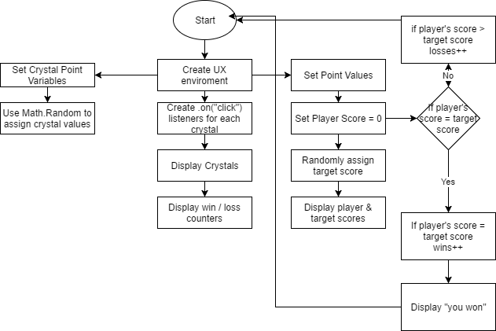
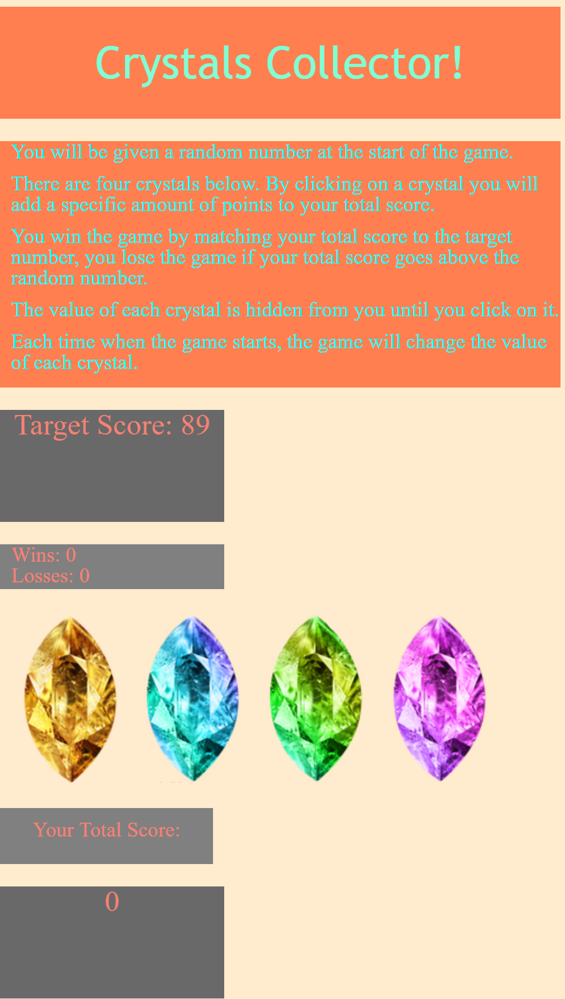

# Crystals the Game
<ul>

<li>You will be given a random number at the start of the game.</li>
<li>There are four crystals below. By clicking on a crystal you will add a specific amount of points to your total score.</li>
<li>You win the game by matching your total score to the target number, you lose the game if your total score goes above the random number.</li>
<li>The value of each crystal is hidden from you until you click on it.</li>
<li>Each time when the game starts, the game will change the value of each crystal.</li>
</ul>

# Flow Chart

# Screenshot

## Author

[Jordan Gary](https://github.com/JigSays)

# Technologies Used

<ul>
<li> HTML5 </li>
<li>JavaScript</li>
<li>jQuery</li>
<li>CSS3</li>
</ul>

